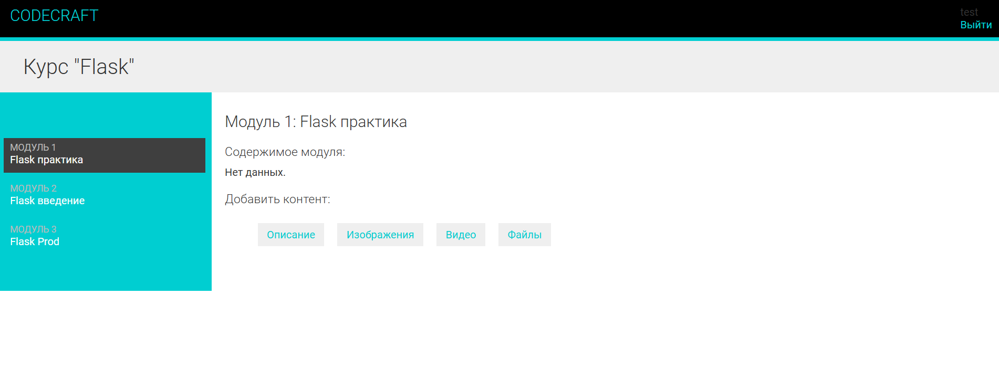
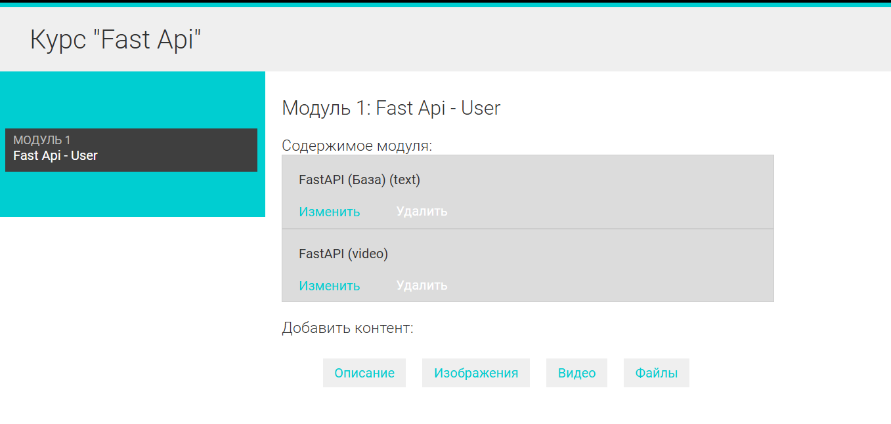

code_craft

## Проект Django: code_craft_education

Образовательная платформа для Backend разработчиков: CODECRAFT

## Технологии:

1. Python: 3.9;
2. Django: 4.1;
3. UnitTest
4. MySQL.
5. HTML / CSS / JS

## Описание функциональности
1. Добавлены возможности CRUD для автора\преподавателя курса:
2. Добавление курса;
3. Добавление модуля курса;
4. Добавление контента в модуль курса;

5. Добавлена возможность регистрации для студентов
6. Добавлена возможность записаться на курс
7. Тестово был настроен Redis и Memcached ля кеширования проекта

## Скрины проекта
1. Курс: 
2. Модули: 
   

## Установка

1. Клонируйте репозиторий;
2. Перейдите в директорию проекта;
3. Установки зависимости: pip install -r requirements.txt ;
4. Настройте базу данных в файле settings.py ;
5. Выполните миграции: py manage.py makemigrations > python manage.py migrate ;
6. Запустите сервер: py manage.py runserver .

## Настройка окружения

Убедитесь, что у вас установлен Python версии [3.9].

## Лицензия

Проект распространяется под лицензией MIT.

## Контакты

Разработчик: Артур Сахаров
Telegram: grizz_dev
